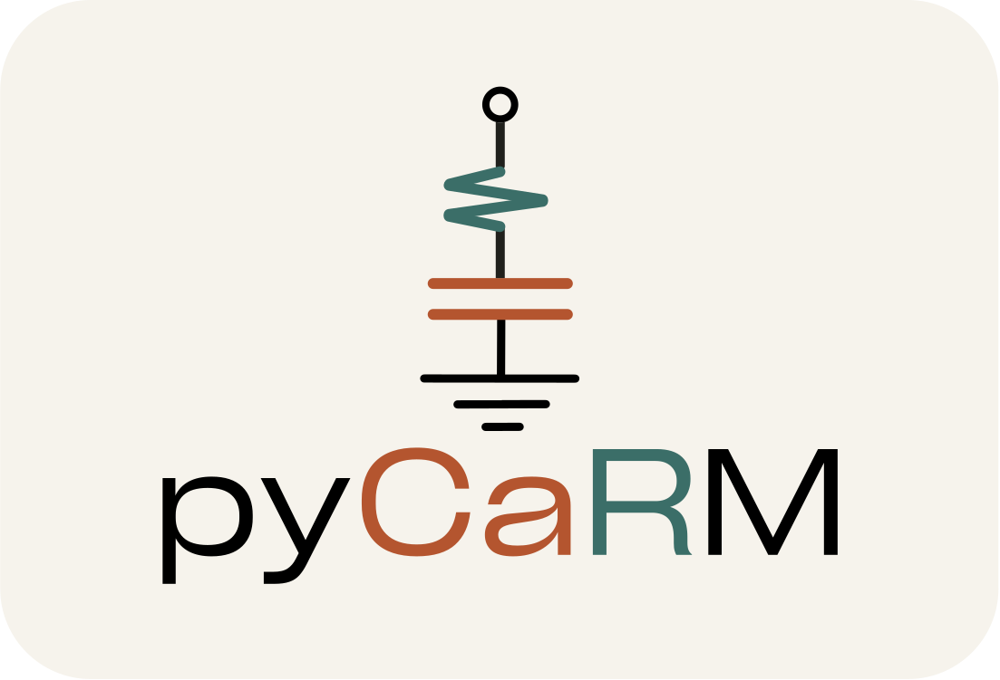

# pyCaRM

[](https://pypi.org/project/pyCaRM-BHE/)
[](https://pypi.org/project/pyCaRM-BHE/)
[](LICENSE)



**pyCaRM** (CApacity Resistance Model) is a Python library for the simulation of 
borehole heat exchanger (BHE) systems. It models the transient thermal response 
of the ground and borehole, supporting single and multi-borehole configurations 
with surface boundary conditions.

> 📖 **Documentation:** https://betalab-team.github.io/pyCaRM/

## Features

- Single and multi-borehole field configurations
- Supported BHE types: single U-tube, double U-tube, coaxial, helical
- Ground stratification support
- Surface boundary conditions (solar radiation, sky radiation, convection)
- Voronoi-based field decomposition for multi-borehole layouts
- Finite Line Source (FLS) thermal interference model
- Parallel and series borehole connection modes
- Heat flux mode: drive the simulation from a heat pump-side thermal load and
  supply temperature, with heat pump COP/EER performance accounted for
- Time-variable grout thermophysical properties driven by soil moisture
  content (irrigation/precipitation input)

## Installation

Install from PyPI:
```bash
pip install pyCaRM-BHE
```

Alternatively, clone the repository and install from source:
```bash
git clone https://github.com/BETALAB-team/pyCaRM.git
cd pyCaRM
pip install .
```

**Developers:**
```bash
git clone https://github.com/BETALAB-team/pyCaRM.git
cd pyCaRM
pip install -e ".[dev]"
```

## Optional Dependencies

- [CoolProp](http://www.coolprop.org) — for computing fluid thermophysical properties. Install with `pip install pyCaRM-BHE[coolprop]`. See [Fluid Properties](https://betalab-team.github.io/pyCaRM/fluid_properties.html) for usage.

## Documentation

Full documentation is available at **https://betalab-team.github.io/pyCaRM/**.

## Examples

Complete working scripts for all supported configurations are available in the
`examples/` folder. See also the [documentation](https://betalab-team.github.io/pyCaRM/)
for detailed usage guides.

- `SingleUtube_multi_parallel.py` — multi-borehole field, parallel mode
- `SingleUtube_multi_series.py` — multi-borehole field, series mode
- `SingleUtube_multi_series_heat_flux.py` — multi-borehole field, series mode, heat flux (COP/EER) mode
- `SingleUtube.py` — single borehole, single U-tube
- `DoubleUtube.py` — single borehole, double U-tube
- `Coaxial.py` — single borehole, coaxial
- `Helical.py` — single borehole, helical
- `Helical_variable_properties.py` — single borehole, helical, time-variable grout properties from soil moisture

## Authors

Developed at **BETALAB** – Department of Industrial Engineering, University of Padova.

- Alessio Tollin
- Angelo Zarrella

## Citation

If you use CaRM in your research, please cite:
```
[Citation will be added after publication]
```

This library is based on the following works:

- De Carli, M., Tonon, M., Zarrella, A., Zecchin, R. (2010). *A computational 
  capacity resistance model (CaRM) for vertical ground-coupled heat exchangers.* 
  Renewable Energy, 35(7), 1537–1550. 
  https://doi.org/10.1016/j.renene.2009.11.034

- Zarrella, A., Scarpa, M., De Carli, M. (2011). *Short time step analysis of 
  vertical ground-coupled heat exchangers: The approach of CaRM.* 
  Renewable Energy, 36(9), 2357–2367. 
  https://doi.org/10.1016/j.renene.2011.01.032

- Zarrella, A., De Carli, M. (2013). *Heat transfer analysis of short helical 
  borehole heat exchangers.* Applied Thermal Engineering, 61(1-2), 34–47. 
  https://doi.org/10.1016/j.applthermaleng.2013.08.011

- Zarrella, A., Capozza, A., De Carli, M. (2013). *Analysis of short helical 
  and double U-tube borehole heat exchangers: A simulation-based comparison.* 
  Applied Energy, 112, 358–370. 
  https://doi.org/10.1016/j.apenergy.2012.09.012

- Najib, A., Zarrella, A., Narayanan, V., Grant, P., Harrington, C. (2019). *A revised 
  capacitance resistance model for large diameter shallow bore ground heat exchanger.* 
  Applied Thermal Engineering, 162, 114305. 
  https://doi.org/10.1016/j.applthermaleng.2019.114305

- Claesson, J., Javed, S. (2011). *An analytical method to calculate borehole fluid 
  temperatures for time-scales from minutes to decades.* 
  ASHRAE Transactions, 117(2), 279–288.

- Cimmino, M., Bernier, M. (2014). *A semi-analytical method to generate g-functions 
  for geothermal bore fields.* International Journal of Heat and Mass Transfer, 70, 
  641–650. https://doi.org/10.1016/j.ijheatmasstransfer.2013.11.037

- Cimmino, M. (2018). *pygfunction: an open-source toolbox for the evaluation of 
  thermal response factors for geothermal borehole fields.* 
  Proceedings of eSim 2018, Montréal, Canada, 492–501.

- Bell, I.H., Wronski, J., Quoilin, S., Lemort, V. (2014). *Pure and pseudo-pure fluid
  thermophysical property evaluation and the open-source thermophysical property library
  CoolProp.* Industrial & Engineering Chemistry Research, 53(6), 2498–2508.
  https://doi.org/10.1021/ie4033999

- Chung, S.O., Horton, R. (1987). *Soil heat and water flow with a partial surface 
  mulch.* Water Resources Research, 23(12), 2175–2186.
  https://doi.org/10.1029/WR023i012p02175

- de Vries, D.A. (1963). *Thermal properties of soils.* In W.R. van Wijk (Ed.), 
  Physics of Plant Environment. North-Holland Publishing Company, Amsterdam.

- Ruhnau, O., Hirth, L., Praktiknjo, A. (2019). *Time series of heat demand and 
  heat pump efficiency for energy system modeling.* Scientific Data, 6, 189. 
  https://doi.org/10.1038/s41597-019-0199-y

## License

MIT License — see [LICENSE](LICENSE) for details.